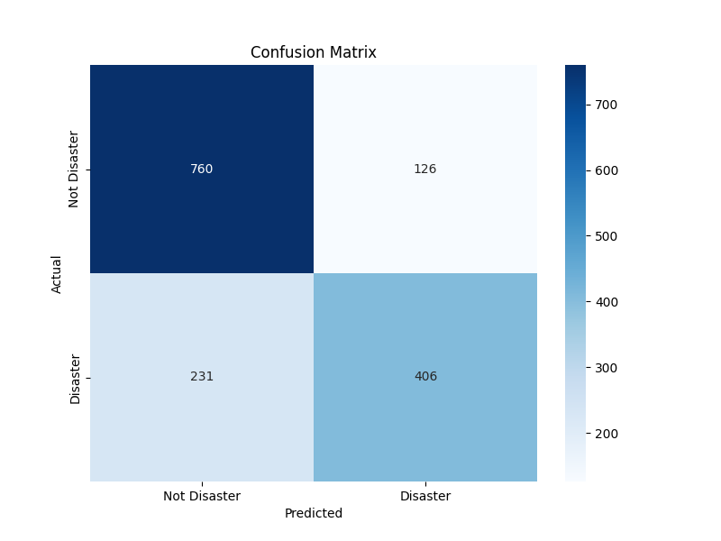

# Kaggle Competition: NLP with Disaster Tweets 🌪️

This repository contains my solution for the Kaggle competition, "[Natural Language Processing with Disaster Tweets](https://www.kaggle.com/c/nlp-getting-started)". The goal is to build a machine learning model that predicts whether a given tweet is about a real disaster or not.

## Project Overview

The project involves a complete NLP workflow to solve a binary classification problem. The model processes tweet text, keyword, and location data to make its predictions. The final submission is generated by a fine-tuned `MultinomialNB` classifier.

---

## 🚀 Workflow Pipeline

The solution follows these key steps:

1.  **Data Loading & Exploration**: Load `train.csv` and `test.csv`. Handle missing values in the `keyword` and `location` columns.
2.  **Feature Engineering**: Combine the preprocessed `text`, `keyword`, and `location` fields into a single input text for the model.
3.  **Text Preprocessing**:
    * Clean the text by removing special characters and converting to lowercase.
    * Tokenize the combined text into individual words.
    * Remove common English stopwords.
    * Apply **Lemmatization** to reduce words to their base form (e.g., "running" -> "run").
4.  **Vectorization**: Convert the processed text into numerical feature vectors using **TF-IDF** (`TfidfVectorizer`) with n-grams `(1, 2)`.
5.  **Model Selection & Tuning**:
    * Initially explored `RandomForestClassifier` and `KNeighborsClassifier`.
    * Used `GridSearchCV` to find the optimal hyperparameters for a `MultinomialNB` model, which yielded the best results.
6.  **Final Prediction**: Train the optimized `MultinomialNB` model on the **entire** training dataset and generate predictions on the test set.
7.  **Submission**: Create the `submission.csv` file in the format required by Kaggle.

---

## 🛠️ Tech Stack

* **Language**: `Python 3.x`
* **Core Libraries**: `Pandas`, `NumPy`
* **NLP**: `NLTK`
* **Machine Learning**: `Scikit-learn`
* **Visualization**: `Matplotlib`, `Seaborn`

---

## Model Performance

The final model is a `MultinomialNB` classifier with `alpha=0.5`, chosen via `GridSearchCV` based on its F1-score. Its performance on a held-out validation set is as follows:

### Classification Report
Classification Report:

              |precision  |  recall | f1-score  | support |
              | :-------- | :-----: | :-------: | -------: |
           | 0    |   0.77  |    0.86   |   0.81  |     886 |
           | 1    |   0.76  |    0.64   |   0.69  |     637 |

    |accuracy                          | 0.77    |  1523 |
    |macro avg      | 0.77    |  0.75    |  0.75    |  1523
    |weighted avg     |  0.77  |    0.77  |    0.76 |    1523


### Confusion Matrix

The confusion matrix below visualizes the model's predictions on the validation set.



*(My final score on the Kaggle public leaderboard was **[Enter Your Kaggle Score Here, e.g., 0.81234]**.)*

---

## How to Reproduce

To reproduce the results and generate the submission file:

1.  **Clone the repository:**
    ```sh
    git clone [https://github.com/]https://github.com/chakri0176/NLP_Disaster_Tweet_Kaggle.git
    cd NLP_Disaster_Tweet_Kaggle
    ```

2.  **Place the data:**
    Download `train.csv` and `test.csv` from the Kaggle competition page and place them in the root directory.

4.  **Run the script/notebook:**
    Execute the main Python script or Jupyter Notebook. It will process the data, train the model, and generate a `submission1.csv` file ready for upload to Kaggle.